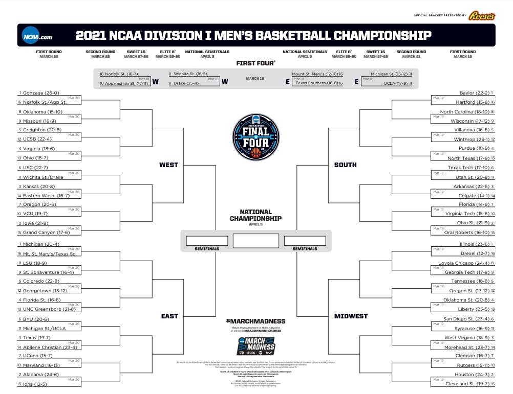
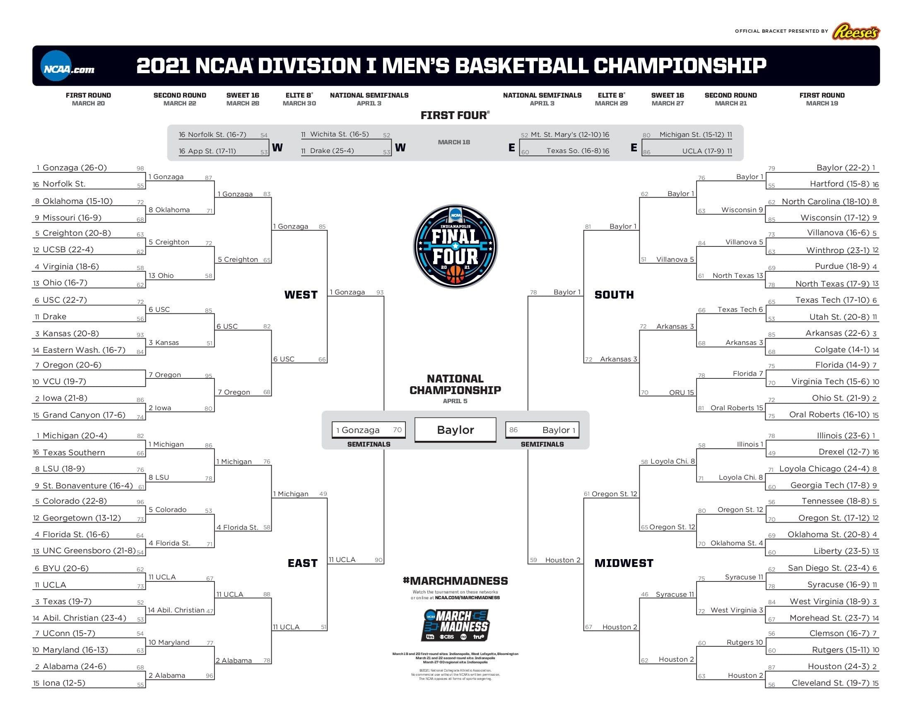
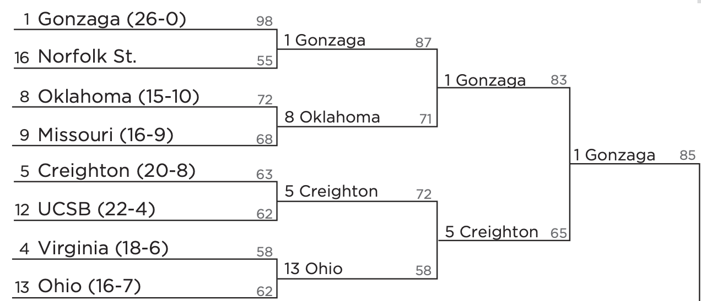

```{r setup, include=FALSE}
knitr::opts_chunk$set(fig.width=15,
                      fig.height=12, 
                      echo = FALSE, 
                      message = FALSE,
                      warning = FALSE, 
                      comment = "")

library(tidyverse)
library(kableExtra)
library(patchwork)

merged <- readr::read_csv(here::here("data", "merged.csv"))
ids <- readr::read_csv(here::here("data", "ids.csv"))
s2021 <- readr::read_csv(here::here("data", "s2021.csv"))
source(here::here("R", "fitting.R"))
theme_set(theme_light(base_size = 25))
```

background-image: url(https://upload.wikimedia.org/wikipedia/en/2/28/March_Madness_logo.svg)

---

# Backround on March Madness Tournament

--

- First hosted in 1939 with 8 participating teams.

--

- Now, restricted to the top 64 qualifying NCAA division I teams.

--

- Currently 16.9 million viewers.

--

- Michigan State won in 1979 and 2000.

--

- Offices, organizations, and friend groups make and submit a total of 40 Million predictions each year.

--

- At the beginning small groups form and gamble on the outcomes by selecting winners and losers. 

--

- Nobody has ever made a perfect bracket prediction and there are $2^{63}$ possible outcomes.

---



---



---

class: center, middle
# Zoomed in



---

class: inverse

## We use basketball season game scores and statistics to predict this year's tournament outcome.

--

## We need to derive a scoring metric.

--

## Evaluate and tune the model.

--

## Compare the model's performance.

--

## We made several models, in the interest of time we are going to discuss the logistic because its the most straight-forward.

---
class: center


```{r fig.width=15, fig.height=12}
hists <- merged %>%
  select(x3fg, fg_percent, rpg, st, to,  bkpg)

histogram <- function(x, t){
  ggplot(data = hists, aes(x)) +
    geom_histogram(bins = 55, color = "white", fill = "#025cba") +
    theme_light(base_size = 25) +
    labs(title = paste0("", t), x = "", y = "") +
    NULL
}

a <- histogram(merged$x3fg,       t = "Three-Points Goals")
b <- histogram(merged$fg_percent, t = "Percentage of Goals Scored")
c <- histogram(merged$rpg,        t = "Rebounds Per Game")
d <- histogram(merged$st,         t = "Steals Per Game")
e <- histogram(merged$to,         t = "Turnovers Per Game")
f <- histogram(merged$bkpg,       t = "Blocks Per Game")
# (a + b + c) / (d + e + f)
(a + b) / (c + d) /(e + f)
```

---

# Real Quick Descriptive Statisticcs

```{r}
descriptive_statistics <- function(x){
  output <- c(mean(x), median(x), sd(x), min(x), max(x))
  output <- round(output, digits = 2)
  return(output)
}

desc_stats <- merged %>%
  select(fg_percent, ft_percent, rpg,st, to, bkpg) %>%
  map_df(descriptive_statistics) %>%
  t()

colnames(desc_stats) <- c("Mean", "Median", "Std. Dev", "Min", "Max")
rownames(desc_stats) <- c("Field Goal Percentage", "Free Throw Percentage", "Rebounds Per Game", "Steals", "Turnovers", "Blocked Shots Per Game")

kable(desc_stats) %>%
  kable_styling(bootstrap_options = c("striped", "hover"))

seasion_seasion <- merged %>%
  nrow()

# n teams
unique_teams <- length(unique(merged$team_id))

# 64 teams in the turniment.

cbind(
    `Games Played` = seasion_seasion,
      Teams = unique_teams,
      Turniment = 64) %>%
  kable() %>%
  kable_styling(bootstrap_options = "striped",
                full_width = F,
                position = "center")
```


- Normal-ish distributions.

- No catastrophic skews or heavy tails.

--

- Ideally we would have had steaks and turn-overs per game rather than season total. Not all played the same game.


---

class: center

# Logistic Model

```{r}
equatiomatic::extract_eq(model = logistic_fit,
                         use_coefs = FALSE,
                         show_distribution = TRUE,
                         wrap = TRUE,
                         terms_per_line = 2,
                         intercept = "beta")
```

---
class: center

Summary

```{r}
row_name <- c("Intercept",
  "Three Pointers", "O* Three Pointers", 
          "Field Goal Percentage", "O* Field Goal Percentage",
          "Free-throw percentage", "O* Free-throw percentage",
          "Rebounds", "O* Rebounds",
          "Steals", "O* Steals",
          "Turnovers", "O* Turnovers",
          "Blocks", "O* Blocks"
          )

cols <- c("Term", "Estimate", "Std. Error", "T-Stat", "P-Value")

table_output <- function(obj, rows){
  broom::tidy(obj) %>%
  mutate(p.value = as.character(p.value), term = row_name) %>%
  mutate_if(is.numeric, round, 3) %>%
  mutate(p.value = as.numeric(p.value))  %>%
  kable(col.names = cols) %>%
  kable_styling(font_size = 15) %>%
  row_spec(rows, color = "white", background = "#025cba") %>% 
  add_footnote("Where O* is the Mertric associated with their opposing team", notation = "none")
}
  broom::tidy(logistic_fit) %>%
  mutate(p.value = as.character(p.value), term = row_name) %>%
  mutate_if(is.numeric, round, 3) %>%
  mutate(p.value = as.numeric(p.value))  %>%
  kable(col.names = cols) %>%
  kable_styling(font_size = 15) %>%
  # row_spec(rows, color = "white", background = "#025cba") %>% 
  add_footnote("Where O* is the Mertric associated with their opposing team", 
               notation = "none")

lrt_stat <- 2*(as.numeric(logLik(logistic_fit)) -
  as.numeric(logLik(logistic_fit_null)))

pval_lrt <- pchisq(lrt_stat, df = 1, lower.tail = FALSE)

dev <- deviance(logistic_fit)

pval_dev <- pchisq(dev, df.residual(logistic_fit), 
       lower.tail = FALSE)

tests <- cbind(
LRT = c(lrt_stat, pval_lrt),
DEViance = c(dev, pval_dev)
)

rownames(tests) <- c("Stat", "P Value")
lrt_dev <- kable(tests) %>% 
  kable_styling(font_size = 10)
lrt_dev
```

---
class: center
Summary


```{r}
table_output(obj = logistic_fit, rows = 2:3)
lrt_dev
```

---
class: center
Summary

```{r}
table_output(obj = logistic_fit, rows = 4:5)
lrt_dev
```

---
class: center
Summary

```{r}
table_output(obj = logistic_fit, rows = 6:7)
lrt_dev
```

---
class: center
Summary

```{r}
table_output(obj = logistic_fit, rows = 8:9)
lrt_dev
```

---
class: center
Summary

```{r}
table_output(obj = logistic_fit, rows = 10:11)
lrt_dev
```

---
class: center
Summary

```{r}
table_output(obj = logistic_fit, rows = 12:13)
lrt_dev
```

---
class: center
Summary

```{r}
table_output(obj = logistic_fit, rows = 14:15)
lrt_dev
```

---
## Scoring

$$\sum_{i=1}^{n} [\mathbf {1} _{\{correct\ prediction\}} \hat{p_i} -\mathbf {1} _{incorrect\ perdiction}\hat{p_i} ] = Model\ Score$$

--

- Basketball games are often quite close and odds in betting markets are often close to 1:1. 

--

- Our goal is to weight correct prediction higher when it assigns a higher probability. Conversely, a lower score to an incorrect prediction.

--

- If our predictions are no better than randomly guessing $E(Model\ Score) = 0$. 

---


## Scoring

$$\sum_{i=1}^{n} [\mathbf {1} _{\{correct\ prediction\}} \hat{p_i} -\mathbf {1} _{incorrect\ perdiction}\hat{p_i} ] = Model\ Score$$

Minimal Example

```{r}
col_fix <- function(x){
  x <- str_replace(x, "_", " ")
  x <- str_to_title(x)
  x
}

logistic_model_score <- readRDS(here::here("cache", "logistic_model_score.RDS")) %>% 
  drop_na() %>% 
  head(10) %>% 
  mutate_if(is.character, str_to_title) %>% 
  mutate_if(is.numeric, round, 2) %>% 
  mutate(phat = if_else(predicted_winner == winner, 
                          predicted_winner_probs, predicted_loser_probs)) %>% 
  rename_all(col_fix) %>%
  rename( `$\\hat{p}$` = Phat) %>% 
  select(Game, `Predicted Winner`, `Winner`, `$\\hat{p}$`, Score)
```


```{r}
logistic_model_score %>% 
  kable(align = "r") %>% 
  kable_styling(font_size = 15) 
```

---

## Scoring

$$\sum_{i=1}^{n} [\mathbf {1} _{\{correct\ prediction\}} \hat{p_i} -\mathbf {1} _{incorrect\ perdiction}\hat{p_i} ] = Model\ Score$$

Correct Predictions

```{r}
logistic_model_score %>% 
  kable(align = "r") %>% 
  kable_styling(font_size = 15) %>%
  column_spec(c(1:5), color =  ifelse(logistic_model_score$Score > 0, "white", "black"), 
              background = ifelse(logistic_model_score$Score > 0, "#025cba", "#f0f0f0"))
```

---

## Scoring

$$\sum_{i=1}^{n} [\mathbf {1} _{\{correct\ prediction\}} \hat{p_i} -\mathbf {1} _{incorrect\ perdiction}\hat{p_i} ] = Model\ Score$$

Incorrect Predictions

```{r}
logistic_model_score %>% 
  kable(align = "r") %>% 
  kable_styling(font_size = 15) %>% 
  column_spec(c(1:5), color =  ifelse(logistic_model_score$Score > 0, "black", "white"), 
              background = ifelse(logistic_model_score$Score > 0, "white", "#ff3700"))
```

---

## Scoring

$$\sum_{i=1}^{n} [\mathbf {1} _{\{correct\ prediction\}} \hat{p_i} -\mathbf {1} _{incorrect\ perdiction}\hat{p_i} ] = Model\ Score$$

Score

```{r}
logistic_model_score %>% 
  kable(align = "r") %>% 
  kable_styling(font_size = 15)
```
  

```{r fig.align='right'}
paste0("Model Score = ", sum(as.numeric(logistic_model_score$Score))) %>% 
  kable(col.names = "$\\sum_{i}Score$") %>% 
  kable_styling(font_size = 15) %>% 
  row_spec(1, color = "white", background = "#025cba")
```

---

```{r}
perform <- readRDS(here::here("cache", "logistic_model_score.RDS")) %>% 
  mutate(outcome = if_else(score > 0, "Correct", "Incorrect")) %>% 
  drop_na() 
```


```{r fig.height=10}

a <- perform %>%
  ggplot(aes(x = abs(score), fill = outcome)) + 
   geom_histogram(alpha=0.7, position="identity", bins = 10) + 
  labs(title = "Histogram of Scores", x = "Absolute Value of Score") +
  scale_fill_manual(values = c("#025cba", "#ff3700"))

b <- perform %>% 
  ggplot(aes(as.factor(outcome), fill = outcome)) + 
  geom_bar(alpha = 0.7) + 
  labs(title = "", x = "") + 
  scale_fill_manual(values = c("#025cba", "#ff3700")) +
  geom_text(size=10, color = "grey80", stat = 'count',
            aes(label =..count.., hjust = 1.5)) + 
  coord_flip()

a/b
```

```{r}
t2 <- perform %>% 
  summarise(totalscore = sum(score),
            se = sd(score), 
            t = totalscore/se,
            p = pt(t, nrow(perform)-1, lower.tail = F)) %>% 
  t() %>% 
  tibble() %>% 
  mutate_if(is.numeric, round, 2)

rownames(t2) <- c("Total Score", "Standard Error", "T-Statistic", "P-value")
colnames(t2) <- NULL

score <- perform %>% 
  group_by(outcome) %>% 
  summarise(totalscore = sum(score)) %>% 
  mutate(totalscore = round(totalscore, 2))
  
t1 <- rbind(score, c("Total", sum(score$totalscore))) 
colnames(t1) <- c("Result", "Score")

```

```{r}
knitr::kable(list(t1, t2)) %>% 
  kable_styling(font_size = 10)
```
---
class: center
Model Performance

```{r}
a <- perform %>% 
  ggplot(aes(as.factor(outcome), fill = outcome)) + 
  geom_bar(alpha = 0.7) + 
  labs(title = "#2 Logistic Model", x = "", y = "") + 
  scale_fill_manual(values = c("#025cba", "#ff3700")) +
  geom_text(size=10, color = "grey80", stat = 'count',
            aes(label =..count.., hjust = 1.5)) + 
  coord_flip()
```

```{r}
posson_model_score <- readRDS(here::here("cache","posson_model_score.RDS"))

b <- posson_model_score %>% 
  drop_na() %>% 
  ggplot(aes(as.factor(outcome), fill = outcome)) + 
  geom_bar(alpha = 0.7) + 
  labs(title = "#1 Poisson Model", x = "", y = "") + 
  scale_fill_manual(values = c("#025cba", "#ff3700")) +
  geom_text(size=10, color = "grey80", stat = 'count',
            aes(label =..count.., hjust = 1.5)) + 
  coord_flip()
```

```{r}
multinomeal_model_score <- readRDS(here::here("cache", "multinomeal_model_score.RDS"))

c <- multinomeal_model_score %>% 
  drop_na() %>% 
  ggplot(aes(as.factor(outcome), fill = outcome)) + 
  geom_bar(alpha = 0.7) + 
  labs(title = "#3 Multinomeal Model", x = "", y = "") + 
  scale_fill_manual(values = c("#025cba", "#ff3700")) +
  geom_text(size=10, color = "grey80", stat = 'count',
            aes(label =..count.., hjust = 1.5)) + 
  coord_flip()
```


```{r fig.height=11}
b/a/c
```

---
class: inverse

# Conclusion

### Both Logistic and Poisson Regression perform well.

--

### However, we are scoring the model based on independent predictions. While real-world predictions are made dependent on the previous round.

--

### These predictions are not wildly different than betting markets and seeds because they use similar statistics to derive their predictions.


---
class: inverse

# References

Faraway, Julian James. Extending the Linear Model with R:  Generalized Linear,    Mixed Effects and Nonparametric Regression Models.        Chapman &amp; Hall/CRC, 2016. 

